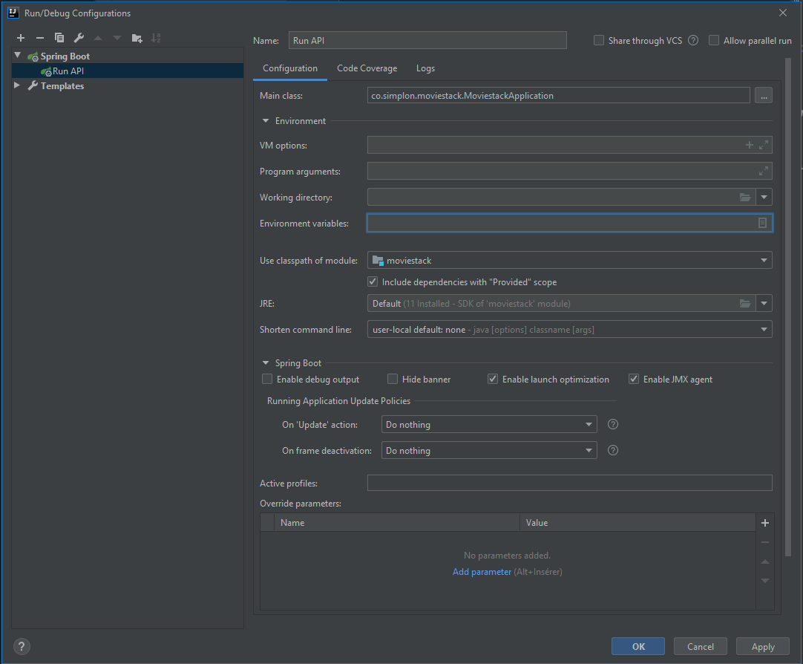
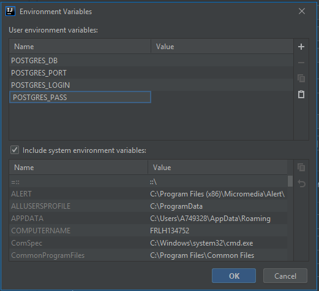
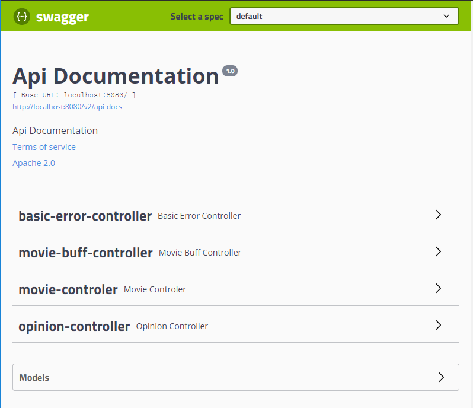
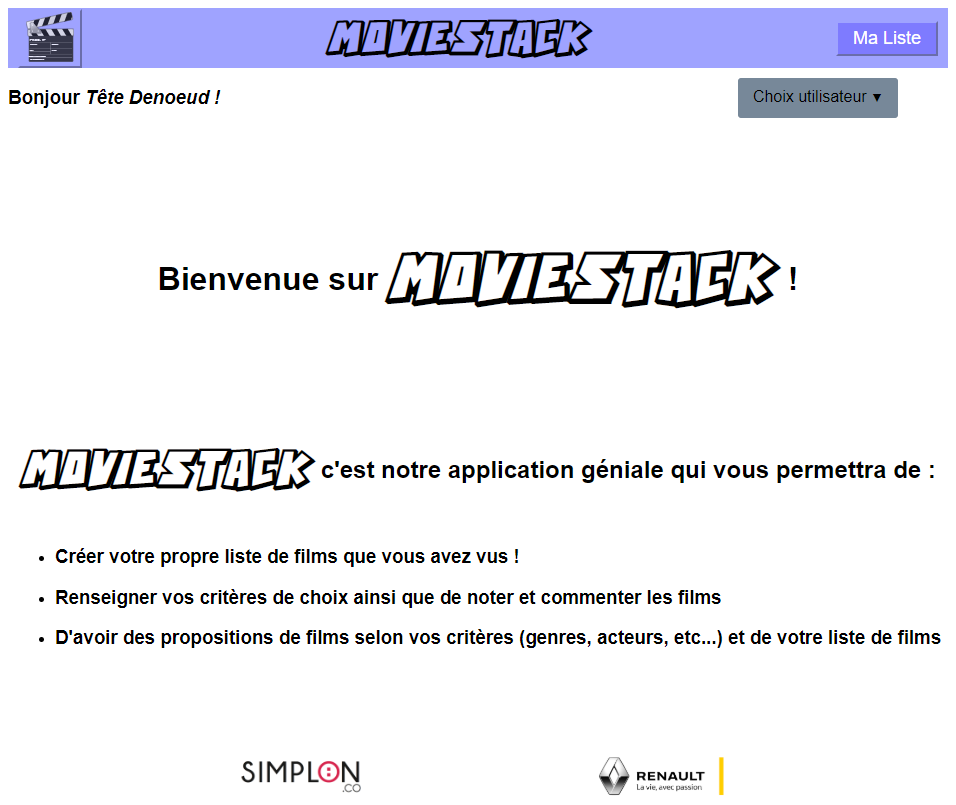

# Fil rouge

Le fil rouge consiste à développer une application Web en groupe sur un thème choisi.

Le thème choisi sera :

`Comment proposer une liste de vidéos adaptée au goût cinématographique d'un cinéphile ?`

## Les étapes du projet

Les étapes du projet ont été détaillées sur la page [La génèse du projet](documentation/genesis.md)

## Le projet

>Dans les sections suivantes le répertoire racine du projet global ( **Backend** / **Frontend** ) sera nommé `PROJECT-ROOT`.

### Prérequis

#### Installation de PostGreSQL

Pour utiliser cette application, il vous faudra créer une base de données PostgreSQL afin que le backend du projet puisse générer le schéma de la base et puisse stocker dans cette base les informations que vous rentrerez via le frontend.

Pour créer la base de données, vous devrez avoir un [SGDB](<nolink> "Système de Gestion de Base de Données") PostgreSQL d'installé sur votre PC.

> IMPORTANT : le serveur de base de données **devra être hébergé** sur **la même machine** que celle sur laquelle vous allez lancer le Backend.

Si ce n'est pas le cas, suivez la [Documentation officielle PostGreSQL](https://www.enterprisedb.com/edb-docs/d/postgresql/installation-getting-started/installation-guide-installers/12/index.html) en récupérant le [fichier d'installation ici](https://www.enterprisedb.com/downloads/postgres-postgresql-downloads).

### Installation

Dans le répertoire `PROJECT-ROOT`, excécuter les commandes suivantes dans cet ordre :

```shell
git clone https://github.com/SylvainSimplonGit/red-thread.git
cd red-thread
git checkout tags/v1.0.2
```

### Configuration Backend

#### Création d'une base de données PostgreSQL

Créer votre base de données PostgreSQL sur votre serveur en gardant de côté les informations suivantes qui vous serviront plus tard :

- Nom de la base de données : <*nom_de_ma_base*>
- Port utilisé (par défaut 5432) : <*port_de_ma_base*>
- Login d'accès à la base : <*login_de_ma_base*>
- Mot de passe du login <*login_de_ma_base*> : <*pass_de_ma_base*>

#### Sous IntelliJ

Ouvrez le projet situé dans le répertoire `PROJECT-ROOT/red-thread/api`.

##### Définir le JDK à utiliser

Dans la classe `MoviestackApplication`, dans la méthode `main`, survolez l'argument `String[]` qui doit être en rouge puis cliquez sur `setup JDK` et selectionnez une version **11** du **JDK**.

##### Définir la configuration

Faites un `add configuration...` pour paramètrer le lancement de l'application.

Ajoutez une configuration depuis le template `Spring boot`.

Ensuite configurer l'application comme suit :



Vous pouvez renseigner le `Name` de la configuration avec ce que vous souhaitez. Cette information sera réutilisée plus tard sous le nom <*nom_de_la_configuration*>.

Dans notre exmple, nous avons choisi `Run API`.

Puis ajouter les variables d'environnements suivantes :



avec comme valeur pour chaque variable d'environnement :

- POSTGRES_DB : [Le nom de la base que vous avez créée](<nolink> "<*nom_de_ma_base*>")
- POSTGRES_PORT : [Le port utilisé par le serveur PostgreSQL](<nolink> "<*port_de_ma_base*>")
- POSTGRES_LOGIN : [Le login utilisé pour accéder à la base](<nolink> "<*login_de_ma_base*>")
- POSTGRES_PASS : [Le mot de passe du login pour accéder à la base](<nolink> "<*pass_de_ma_base*>")

#### Exécuter le Backend

Une fois configuré, lancez le backend en cliquant dans le menu `Run` puis <*nom_de_la_configuration*> ou utilisez le raccourci `MAJ` + `F10`.

Dans notre cas <*nom_de_la_configuration*> correspond à `Run API`.

Une fois lancer le backend, vous devriez voir en cliquant sur le lien suivant :

[http://localhost:8080/swagger-ui.html](http://localhost:8080/swagger-ui.html)

ceci :



C'est la preuve que votre Backend est bien fonctionnel !

### Configuration Frontend

#### Sous WebStorm

Ouvrez le projet situé dans le répertoire `PROJECT-ROOT/red-thread/ihm`.
Cliquez sur `Run 'npm install'` dans le popup `Install Dependencies`.

Patientez le temps de l'installation des dépendances...

Puis lancer le frontend en cliquant dans le menu `Run` puis `Run Angular CLI Server` ou utilisez le raccourci `MAJ` + `F10`

Au premier lancement de l'application, cela peut être un peu long, le temps de compiler les différents modules.

Ensuite, cliquez sur le lien suivant pour accéder au frontend de l'application :

[http://localhost:4200/](http://localhost:4200/)

Vous devriez voir ceci :



C'est la preuve que votre Frontend est bien fonctionnel !
